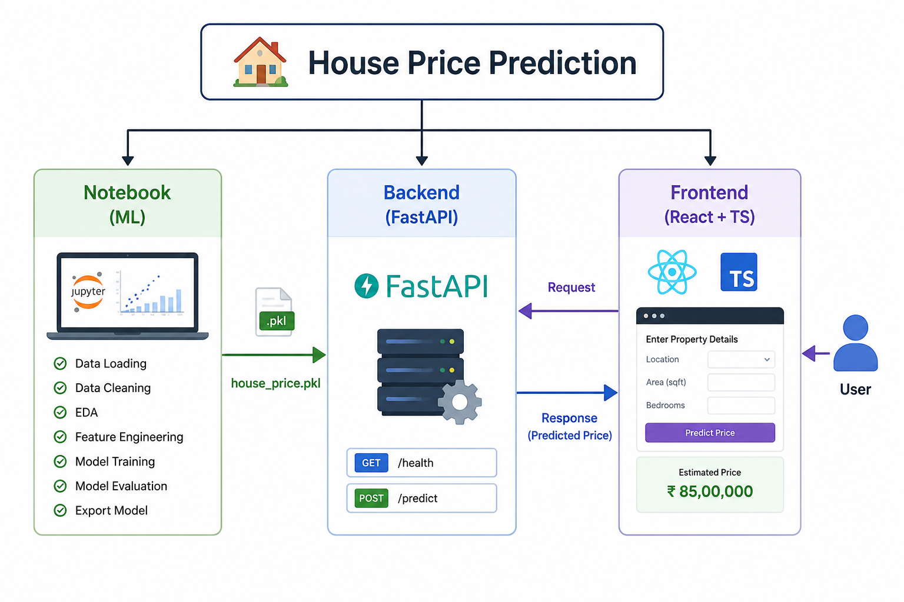
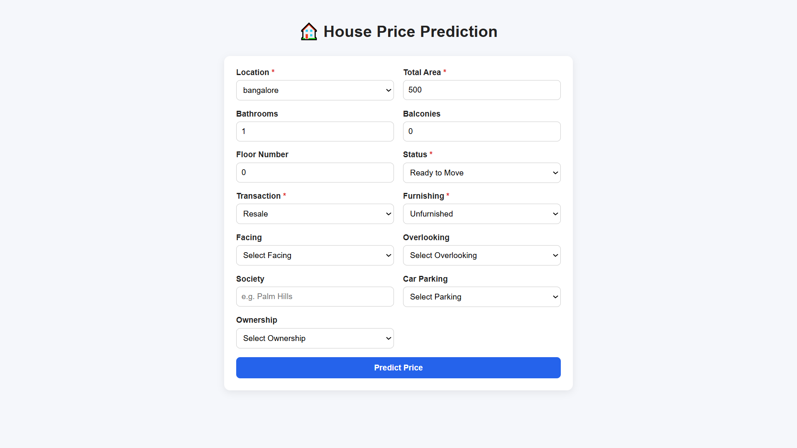
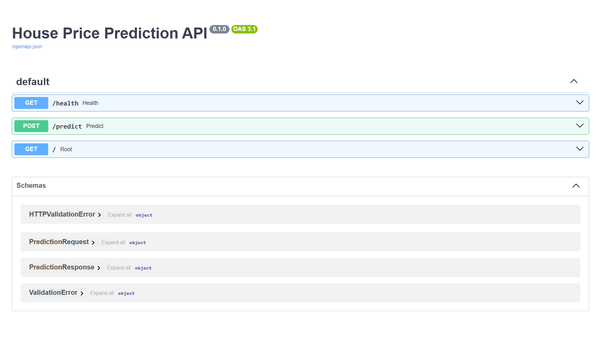

# House Price Prediction App

🎯 End-to-end house price estimation web application powered by machine learning, FastAPI, and React + TypeScript.

## Visual Overview



## What this project includes

- **Frontend**: React + TypeScript user interface for entering property data and showing results
- **Backend**: FastAPI service for validation, preprocessing, and model inference
- **Notebook**: Jupyter notebook for training, evaluating, and exporting the ML model

## Architecture

- `frontend/`: React + Vite UI app for user input and prediction display
- `backend/`: FastAPI API for validation, preprocessing, and model inference
- `notebooks/`: Jupyter notebook for model training and evaluation
- `docs/screenshots/`: screenshot assets used by README files

## Project structure

```
.
├── .gitignore
├── LICENSE
├── README.md
├── backend
│   ├── .dockerignore
│   ├── .env.example
│   ├── Dockerfile
│   ├── README.md
│   ├── app
│   │   ├── api
│   │   ├── core
│   │   ├── main.py
│   │   ├── schemas
│   │   ├── services
│   │   └── utils
│   ├── models
│   │   ├── preprocessor.pkl
│   │   └── xgb_house_model.pkl
│   ├── requirements.txt
│   └── tests
│       └── test_prediction.py
├── docs
│   └── screenshots
│       ├── frontend-404.png
│       ├── frontend-home.png
│       ├── frontend-result.png
│       ├── swagger-docs.png
│       └── workflow.png
├── frontend
│   ├── .env
│   ├── .env.example
│   ├── .gitignore
│   ├── README.md
│   ├── eslint.config.js
│   ├── index.html
│   ├── package.json
│   ├── public
│   │   ├── favicon.svg
│   │   └── icons.svg
│   ├── src
│   │   ├── App.tsx
│   │   ├── api
│   │   ├── assets
│   │   ├── components
│   │   ├── index.css
│   │   ├── main.tsx
│   │   ├── pages
│   │   └── types
│   ├── tsconfig.app.json
│   ├── tsconfig.json
│   ├── tsconfig.node.json
│   └── vite.config.ts
└── notebooks
    ├── README.md
    ├── data
    │   ├── house_prices.csv
    │   └── locations.json
    └── house_price_model.ipynb
```

## Preview Screenshots




## Prerequisites

- Python 3.10+
- Node.js 18+
- npm

## Run the backend

```bash
cd backend
python -m venv .venv
source .venv/bin/activate
pip install -r requirements.txt
uvicorn app.main:app --reload
```

The backend will run at `http://127.0.0.1:8000`.

## Run the frontend

```bash
cd frontend
npm install
npm run dev
```

The frontend will run at `http://127.0.0.1:5173`.

## Notebook workflow

```bash
cd notebooks
jupyter notebook
```

Open `house_price_model.ipynb` to inspect data preparation, model training, evaluation, and export.

## API Endpoints

- `GET /health` — health check
- `POST /predict` — predict house price from property data
- `GET /docs` — OpenAPI swagger documentation
