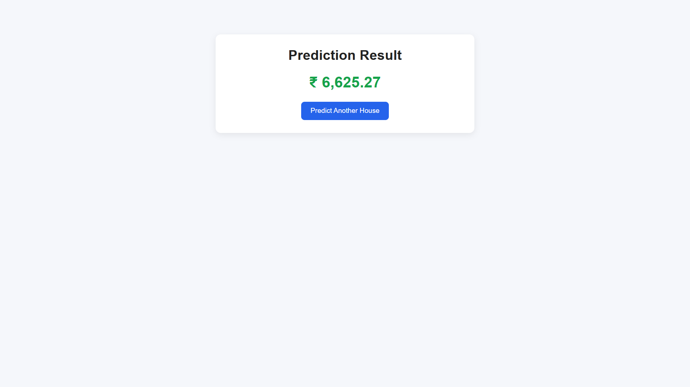
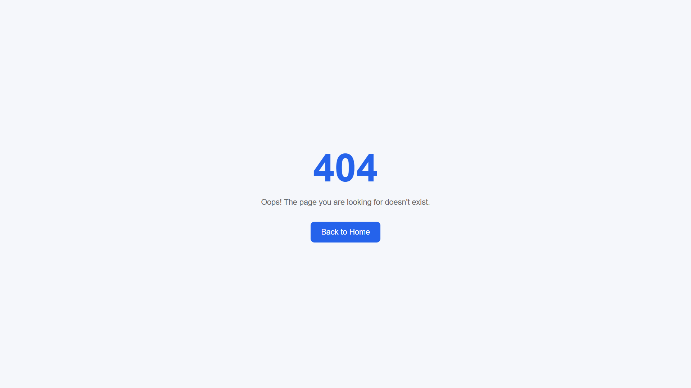

# Frontend

Premium React + TypeScript interface for the house price prediction application.

## UI Preview


## Tech Stack

- React 19
- TypeScript
- Vite
- React Router
- ESLint

## Features

- Property input form with user-friendly controls
- Sends prediction requests to the backend API
- Displays the predicted price on a dedicated result page
- Clean 404 page for invalid routes

## Screenshots

- Homepage form

  

- Result screen

  

- 404 page

  


## Install

```bash
cd frontend
npm install
```

## Run locally

```bash
npm run dev
```

Open `http://127.0.0.1:5173` in your browser.

## Build

```bash
npm run build
```

## Lint

```bash
npm run lint
```

## Frontend structure

```
frontend
├── .env
├── .env.example
├── .gitignore
├── README.md
├── eslint.config.js
├── index.html
├── package.json
├── public
│   ├── favicon.svg
│   └── icons.svg
├── src
│   ├── App.tsx
│   ├── api
│   │   └── predictionClient.ts
│   ├── assets
│   │   └── locations.json
│   ├── components
│   │   ├── PredictionForm.css
│   │   └── PredictionForm.tsx
│   ├── index.css
│   ├── main.tsx
│   ├── pages
│   │   ├── HomePage.tsx
│   │   ├── NotFoundPage.tsx
│   │   └── ResultPage.tsx
│   └── types
│       └── prediction.ts
├── tsconfig.app.json
├── tsconfig.json
├── tsconfig.node.json
└── vite.config.ts
```

This structure keeps the UI, API client, page routing, and type definitions in one clear frontend module.

### Folder descriptions

- `.env` / `.env.example` — environment variables for frontend configuration.
- `public/` — static assets served by Vite, including the favicon and icons.
- `src/App.tsx` — top-level router and page wiring.
- `src/api/` — backend request client and API helpers.
- `src/assets/` — static data used by the UI, such as locations.json.
- `src/components/` — reusable form and UI components.
- `src/pages/` — application pages for home, results, and 404 routes.
- `src/types/` — shared TypeScript interfaces for prediction requests and responses.
- `vite.config.ts` / `tsconfig*.json` — build and TypeScript configuration.

